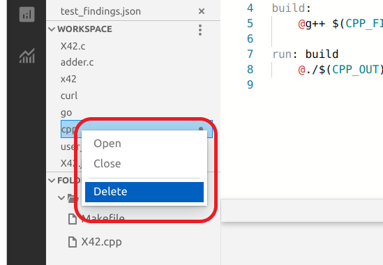
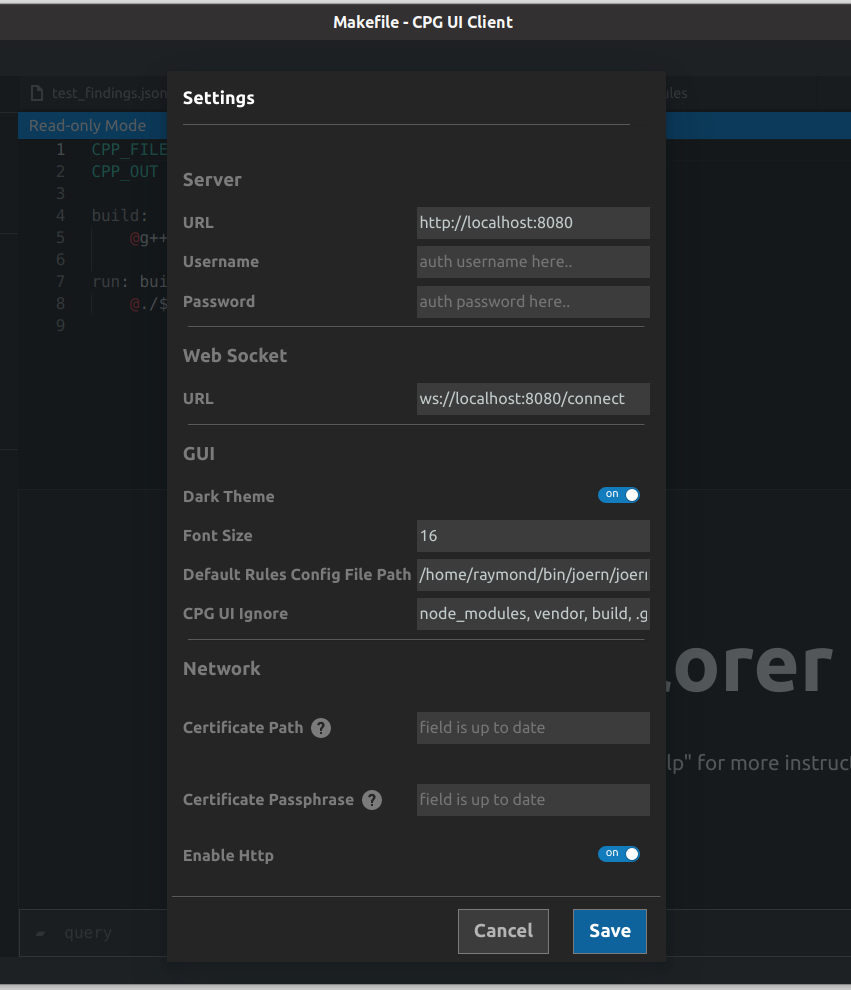

-------
Usage
-------

Below is a labeled diagram of the main sections of CPG UI Client;

1. File Menu
2. Explorer section toggle control
3. Scripts section
4. Opened files section
5. Workspace section
6. Terminal section toggle control
7. Settings modal toggle control
8. Queries status section
9. Explorer section
10. Folders section
11. Server connection status section
12. Query input section
13. Terminal view section
14. Editor section
15. Terminal hide control
16. Terminal mode toggle control
17. Terminal minimize/maximize control

1. File Menu
==================

This section contains the normal actions one would expect to be in the 
file menu section of every tool, plus actions that are unique to code analytic 
tools like importing code and switching workspace:

2. Explorer section toggle control
======================================================================

This control button can be used to collapse and expand the whole explorer section.

3. Scripts section
======================================================================

This section is where all the scripts under the current default scripts folder are displayed. 
Scripts can be created, edited, and deleted through the editor but other files can only be viewed on the editor.
* To further organize your scripts, you can add a special type of comment (e.g. //<tag>my new tag</tag>) 
  to your script files and the scripts will be organized according to the tag name added in the comment

.. image:: ./organised_scripts_section.png

* Clicking on the "more" icon at the top right-hand side of the script section reveals a hidden menu through 
  which you can perform actions such as deleting selected scripts or changing the default scripts folder.

.. image:: ./screenshot_scripts_context.png

* you can select multiple scripts to delete by holding down the "ctrl" button and clicking on the scripts you want to select.
* To delete a single script, right-click on the script to reveal the "delete" context menu

4. Opened files section
======================================================================

Here you will see all the files that are currently open in the editor. Clicking on a file makes it the active file on the editor

5. Workspace section
======================================================================

This section contains all the projects open in a particular workspace.
* If the workspace does not contain any project, you will be asked to import a project.
* Clicking on the "more" icon at the top right-hand side of the workspace section 
  reveals a hidden menu where you can perform actions like importing a project, deleting a project, and switching to a different workspace

* Right-clicking on individual projects also reveals a context menu where you open, close, and delete a single project

6. Terminal section toggle control
======================================================================

This control determines if the terminal section should be hidden or visible.

7. Settings modal toggle control
======================================================================

Clicking on this toggles the settings modal. In the settings, you can specify the URL (and WebSocket URL) to the backend you want the client to connect.
You can also change things like server authentication, font size, theme, large folders to be ignored when rendering sections like the folder and scripts section. 

8. Queries status section
======================================================================

This indicates whether there is a currently running query or not, and how many queries have been run since the tool was opened. 
Hovering on this section reveals additional details showing all previously ran queries, status (pending or completed), and total time it took to run the query.

9. Explorer section
======================================================================

This section houses other sections like folder section, workspace section, etc.

10. Folders section
======================================================================

This section is where the folder structure of the currently active project is displayed. 
* You can inspect the folders and files of the currently active project. 
* When you click on a file in the folder section, the file will be opened in the editor.
* Clicking on the "more" icon at the top right-hand side of the folder reveals a hidden menu through which you can change the folder in view by selecting any folder of your choice.

11. Server connection status section
======================================================================

This section indicates the UI client's connection status to the server. 
* If the server with the server URL in the settings is not active, the connection status will be "failed" and queries won't work.
* You can right-click on this section to manually connect and disconnect from the server

12. Query Input section
======================================================================

Just like you can perform certain actions (like opening, closing, and importing projects) 
through the GUI alone without typing any queries, you can also choose to manually type your queries instead.
* To type queries manually, this section is where input your manual queries (in the more terminal-like view, you input your queries in a terminal-like view instead)
* Queries and results will appear on top according to the order you ran them.

13. Terminal view sectionScripts
======================================================================

This is the place where you can view queries and their results (in the terminal-like view, this looks like a traditional terminal view)

14. Editor section
======================================================================

This is the section where scripts can be viewed and edited. Other files that are not scripts can only be viewed here, the editor only allows read-only mode for those files.

15. Terminal hide control
======================================================================

This controls whether the terminal section is visible or not.

16. Terminal mode toggle control
======================================================================

With this, you can control the view of the terminal section.
* If you prefer a more command line-like interface or a rich GUI mode, you can select it by toggling this control

17. Terminal minimize/maximize control
======================================================================

As the name suggests, this can be used to minimize or maximize the terminal.

Secure and Non-Secure Connections
======================================================================

The first time you run this UI, without setting up an HTTPS server and uploading an SSL certificate or enabling HTTP connection in the settings, 
you will get an error saying that HTTP connections are disabled. If you just want to quickly test queries and wouldn't want the additional trouble 
of setting up an HTTPS reverse-proxy for your Joern installation, you can click the settings icon and enable HTTP connections.
If you plan on using the UI for more serious work however, it is advisable to go through the additional trouble of setting up the HTTPS reverse-proxy and getting it to work with the UI.
This is to ensure that all the traffic between the UI client and the Joern server is encrypted and secure.
Luckily we wrote a basic script template to help make the HTTPS reverse-proxy server setup and certificate generation on your local machine painless.

To set up your basic HTTPS reverse-proxy server with a self-signed certificate on your local machine, follow the steps below:

* Open the source code folder in the tar.gz/ zip of the release you have installed (You can contact the Joern team to help you if you can't find this).

* Inside the repository folder, copy the file named "httpslocalhost.sh" to any folder of your choice (Desktop for example).

* Run the copied file with the command ``sudo bash ./httpslocalhost.sh``

* Open the UI settings and add "/etc/nginx/ssl/localhost.p12" to the "Certificate Path" field.

* On the "Certificate Passphrase" field, add the following passphrase "4346d3D2fgefr43542w4w5trdfd3454fsFR3trYFDBrtERT4653wedfgtrfdgsREWWE345w3" then click on save.

If you get a toast saying "Certificate Import Successful" then congratulations, the connection between your Joern server and the UI is encrypted and secured with HTTPS.

.. note:: that the httpslocalhost.sh script Is for demonstration use only. you probably need to use a custom passphrase for the pkcs12 file 
          that will be imported into the UI. To change this passphrase, you need to edit the httpslocalhost.sh script to replace the above passphrase with your custom passphrase. 
          If you need to specify the passphrase using env, you can visit this `link <https://www.openssl.org/docs/man1.1.1/man1/openssl.html/>`_ to learn the various options available for specifying passphrase. 
          If you choose to change the above passphrase to a custom one, do remember that certain special characters are not handled properly on openssl. You might need to stick with letters and numbers.

Advanced
~~~~~~~~~~~~~~~~~~~~~~~~~~~~~~~~~~~~~~~~~~~~~~~~~~~~~~~~~~~~~~~~~~~~~~~

If you would like to create and manage your own reverse-proxy and ssl certificates, there are a few things to keep in mind:

CA-Signed:
  If your server is using a certificate signed by a trusted certificate authority, you don't need to do anything. Just add the URL and start making queries.

Self-Signed:
  If your certificate is self-signed, make sure that you are using the generic certificate signing method where you generate the root certificate and use it to sign a second certificate (server certificate). \
  Also, don't forget to add your local root CA to trusted roots on your local machine. You can check out how we do this by reading the httpsloalhost.sh file. 
  To get the certificate to upload to the UI, you need to convert your server certificate to pkcs12 format. Also, avoid using special characters for the pkcs12 file passphrase or you might not be able to decrypt the file after creation.